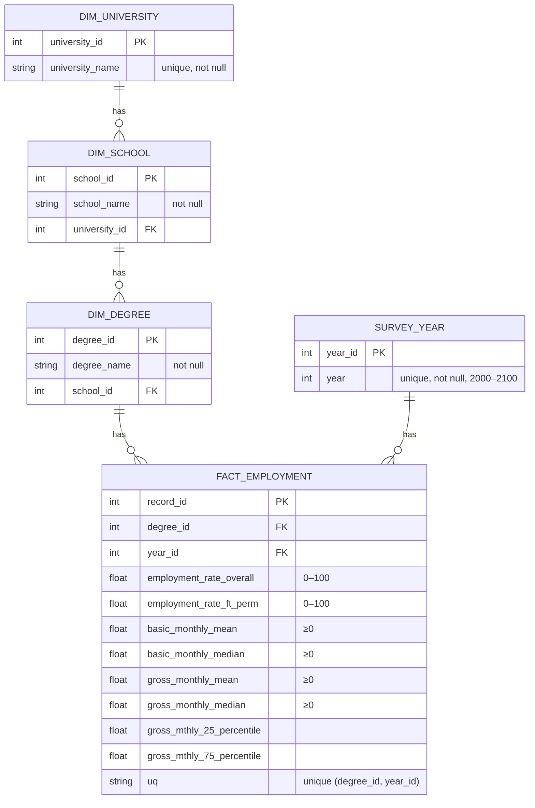

```mermaid
erDiagram
    DIM_UNIVERSITY ||--o{ DIM_SCHOOL : has
    DIM_SCHOOL     ||--o{ DIM_DEGREE : has
    DIM_DEGREE     ||--o{ FACT_EMPLOYMENT : has
    SURVEY_YEAR    ||--o{ FACT_EMPLOYMENT : has

    DIM_UNIVERSITY {
        int    university_id PK
        string university_name "unique, not null"
    }
    DIM_SCHOOL {
        int    school_id PK
        string school_name "not null"
        int    university_id FK
    }
    DIM_DEGREE {
        int    degree_id PK
        string degree_name "not null"
        int    school_id FK
    }
    SURVEY_YEAR {
        int year_id PK
        int year "unique, not null, 2000–2100"
    }
    FACT_EMPLOYMENT {
        int   record_id PK
        int   degree_id FK
        int   year_id   FK
        float employment_rate_overall "0–100"
        float employment_rate_ft_perm "0–100"
        float basic_monthly_mean "≥0"
        float basic_monthly_median "≥0"
        float gross_monthly_mean "≥0"
        float gross_monthly_median "≥0"
        float gross_mthly_25_percentile
        float gross_mthly_75_percentile
        string uq "unique (degree_id, year_id)"
    }
```