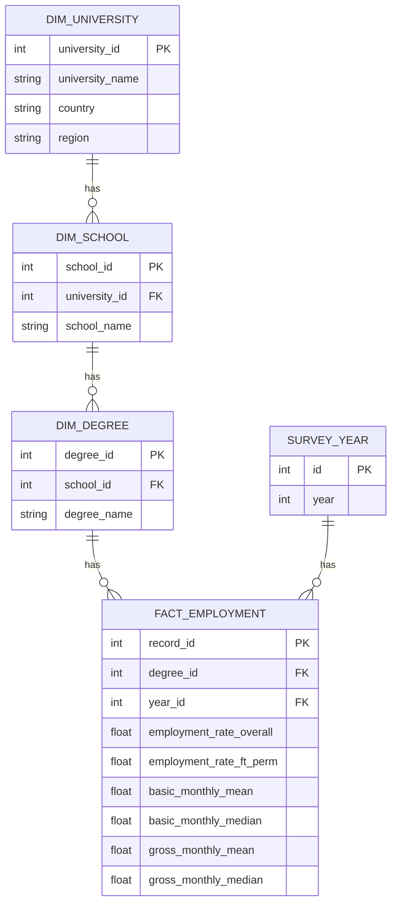

```mermaid
erDiagram
  DIM_UNIVERSITY  ||--o{ DIM_SCHOOL     : has
  DIM_SCHOOL     ||--o{ DIM_DEGREE     : has
  DIM_DEGREE     ||--o{ FACT_EMPLOYMENT: has
  SURVEY_YEAR    ||--o{ FACT_EMPLOYMENT: has

  DIM_UNIVERSITY {
    int    university_id  PK
    string university_name
    string country
    string region
  }

  DIM_SCHOOL {
    int    school_id      PK
    int    university_id  FK
    string school_name
  }

  DIM_DEGREE {
    int    degree_id      PK
    int    school_id      FK
    string degree_name
  }

  SURVEY_YEAR {
    int    id             PK
    int    year
  }

  FACT_EMPLOYMENT {
    int    record_id          PK
    int    degree_id          FK
    int    year_id            FK
    float  employment_rate_overall
    float  employment_rate_ft_perm
    float  basic_monthly_mean
    float  basic_monthly_median
    float  gross_monthly_mean
    float  gross_monthly_median
  }
```