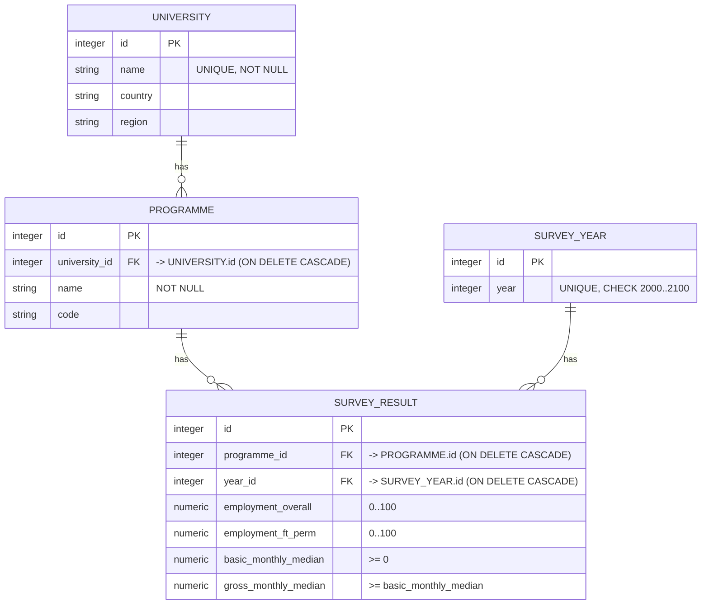

```mermaid
erDiagram
    UNIVERSITY ||--o{ PROGRAMME : has
    PROGRAMME ||--o{ SURVEY_RESULT : has
    SURVEY_YEAR ||--o{ SURVEY_RESULT : has

    UNIVERSITY {
        integer id PK
        string  name  "UNIQUE, NOT NULL"
        string  country
        string  region
    }

    PROGRAMME {
        integer id PK
        integer university_id FK "-> UNIVERSITY.id (ON DELETE CASCADE)"
        string  name  "NOT NULL"
        string  code
    }

    SURVEY_YEAR {
        integer id PK
        integer year "UNIQUE, CHECK 2000..2100"
    }

    SURVEY_RESULT {
        integer id PK
        integer programme_id FK "-> PROGRAMME.id (ON DELETE CASCADE)"
        integer year_id FK "-> SURVEY_YEAR.id (ON DELETE CASCADE)"
        numeric employment_overall  "0..100"
        numeric employment_ft_perm  "0..100"
        numeric basic_monthly_median ">= 0"
        numeric gross_monthly_median ">= basic_monthly_median"
    }
```