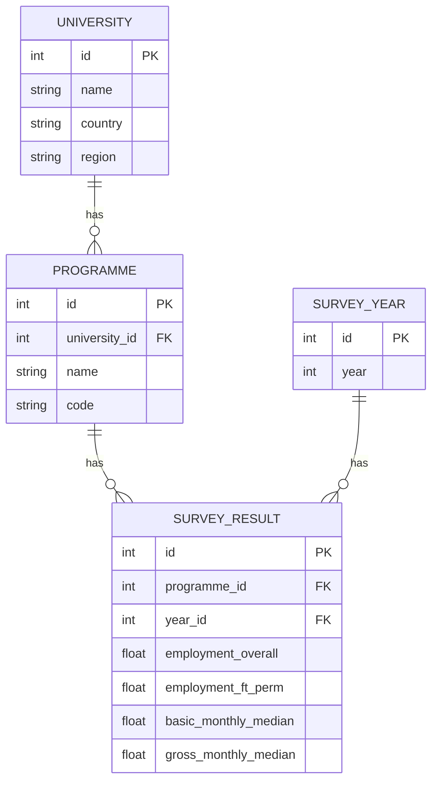

```mermaid
erDiagram
  UNIVERSITY  ||--o{ PROGRAMME     : has
  PROGRAMME   ||--o{ SURVEY_RESULT : has
  SURVEY_YEAR ||--o{ SURVEY_RESULT : has

  UNIVERSITY {
    int    id      PK
    string name
    string country
    string region
  }

  PROGRAMME {
    int    id           PK
    int    university_id FK
    string name
    string code
  }

  SURVEY_YEAR {
    int    id    PK
    int    year
  }

  SURVEY_RESULT {
    int    id                 PK
    int    programme_id       FK
    int    year_id            FK
    float  employment_overall
    float  employment_ft_perm
    float  basic_monthly_median
    float  gross_monthly_median
  }
```